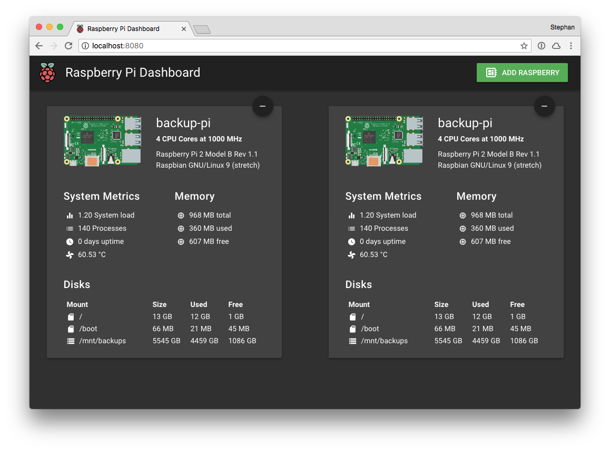

# pi-dashboard

A dashboard to display status information about the raspberries running in your household.




## Requirements

* Docker - For running the dashboard
* [stijink/raspberry-status-server](https://github.com/stijink/raspberry-status-server) needs to be running on each raspberry you want to monitor


## Setup

The easiest way to run the dashboard is by using docker. 


``` bash
# Build the dashboard container
bin/build.sh

# Start the dashboard container
bin/start.sh
```

After you built and started the dashboard docker container you can access the tool at `http://{your-hostname}:8080`.


## License

This project is licensed under the MIT license.
